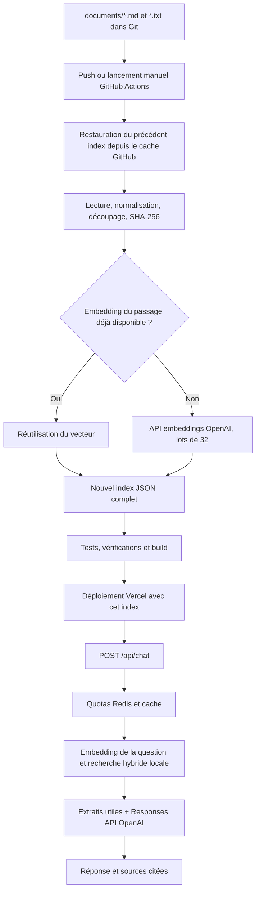

# Backend RAG : indexation, stockage et exploitation

## Architecture

Le backend est une route Next.js Node.js déployée sur Vercel. OpenAI calcule les
embeddings et génère les réponses. Le corpus est petit : la recherche vectorielle
et textuelle s'effectue dans le processus serveur, sans base vectorielle externe.
Redis Upstash sert aux quotas partagés et au cache de réponses, pas au corpus.



## Parcours précis de l'indexation

1. Placer les sources dans `documents/`, sous-dossiers inclus. Seuls `.md` et `.txt`
   sont lus. Les fichiers cachés et liens symboliques sont ignorés. Convertir les
   PDF en texte avant de les ajouter. Les références de `docs/` ne sont pas indexées.
2. Un push ou `workflow_dispatch` déclenche `.github/workflows/index-and-deploy.yml`.
   Une pull request exécute seulement les tests et le build : aucune indexation ni
   aucun déploiement, même si des secrets existent.
3. GitHub restaure `data/rag-index.json` depuis son cache. Une correspondance exacte
   tient compte de la branche, du script et du contenu des documents. Sinon il
   essaie un index précédent de la branche, puis d'une autre branche, puis d'une
   version précédente du script. Chaque vecteur est revalidé avant réutilisation.
   Sans cache, il utilise l'index du checkout Git.
4. Le script relit les fichiers dans un ordre déterministe. Il normalise les
   fins de ligne et retire les espaces aux extrémités. Le découpage actuel,
   conservé pour réutiliser les vecteurs existants, est de **1 800 caractères
   Unicode maximum, avec 200 caractères de recouvrement**. Il n'est pas exprimé
   en tokens et ne suit pas encore les sections Markdown.
5. Chaque passage reçoit un SHA-256 de son texte. Un embedding précédent est
   réutilisable si son hash correspond au texte, si le vecteur est valide et si
   le modèle et les dimensions de l'index correspondent : `text-embedding-3-small`,
   1 536 dimensions. La réutilisation repose sur le contenu, pas sur la date du fichier.
6. Les passages nouveaux sont dédupliqués par hash, puis envoyés à OpenAI par
   lots de 32. Deux passages identiques, même dans deux fichiers, nécessitent
   un seul nouveau calcul. L'index conserve néanmoins les deux sources.
7. Le nouvel index contient uniquement les fichiers présents. Il inclut le
   manifeste des documents (chemin, hash, nombre de passages), le découpage,
   et pour chaque passage : texte, source, position, identifiant, hash et vecteur.
8. Si le JSON obtenu est strictement identique, le script ne réécrit pas le fichier.
   Sinon il écrit un fichier temporaire puis le renomme. En cas d'erreur OpenAI,
   l'index précédent reste intact et la CI échoue avant le déploiement. Les lots
   déjà calculés pendant cette tentative peuvent avoir été facturés ; leurs
   résultats ne sont pas sauvegardés partiellement et seront recalculés au prochain essai.
9. La CI conserve l'index comme artifact 7 jours et dans son cache GitHub, puis
   construit et déploie l'application avec cet index. Les caches GitHub peuvent
   être évincés : ce sont des accélérateurs, pas une sauvegarde garantie.

| Modification | Effet |
| --- | --- |
| Aucun contenu ne change et cache disponible | Aucun appel OpenAI ; embeddings réutilisés ; index inchangé sans écriture |
| Une partie d'un fichier change | Seuls les passages dont le texte change nécessitent un embedding |
| Insertion au début d'un long fichier | Le découpage fixe peut décaler plusieurs passages et donc provoquer plusieurs recalculs |
| Fichier ajouté | Calcul des passages nouveaux ; textes déjà présents réutilisés |
| Fichier supprimé | Ses passages disparaissent du nouvel index sans appel OpenAI |
| Fichier renommé | Vecteurs réutilisés ; chemins et identifiants mis à jour |
| Fichier dupliqué | Vecteurs partagés par contenu ; sources distinctes conservées |
| Fins de ligne Windows/Linux seulement | Pas de nouveaux embeddings après normalisation |
| Changement de modèle ou de dimensions | Vecteurs précédents incompatibles ; recalcul nécessaire |
| Cache perdu et index du dépôt vide | Réindexation complète nécessaire |

Une nouvelle indexation n'est visible sur le site qu'après le déploiement réussi.
Un simple build Next.js n'indexe rien et ne fait aucun appel OpenAI.

## Où sont stockées les données ?

| Donnée | Emplacement |
| --- | --- |
| Documents originaux | `documents/` dans le dépôt Git et ses checkouts |
| Textes découpés + embeddings + manifeste | `data/rag-index.json`, localement ou dans le runner GitHub |
| Copie de l'index pour la CI | Cache GitHub et artifact de 7 jours |
| Index utilisé en production | Bundle serveur du déploiement Vercel, importé via `server-only` |
| Réponses en cache | Redis Upstash, expiration de 24 heures |
| Compteurs de quotas | Redis Upstash ; IP identifiée par HMAC, jamais enregistrée en clair |
| Questions et historique | Mémoire de la requête ; envoyés à OpenAI pour la génération, pas de base de conversations locale |
| Logs | Métriques de tokens, latence, modèle et erreurs ; aucun texte de question/document/réponse |

L'index n'est pas placé dans `public/` et les vecteurs ne sont pas retournés au client.
Il contient néanmoins les textes du corpus : celui-ci doit être destiné aux visiteurs
du portfolio. Les réponses en Redis peuvent reproduire ces informations.
Supprimer un fichier ne supprime pas les copies historiques Git, les anciens
artifacts/caches ou les anciens déploiements Vercel. Ces copies se gèrent séparément.

Les fichiers ne sont pas téléversés via Files API et aucun vector store OpenAI
n'est créé. Le texte des passages nouveaux est toutefois transmis à l'API embeddings.
À chaque génération, OpenAI reçoit la question, l'historique borné et les seuls
extraits retenus. `store: false` est utilisé pour les Responses ; cela ne constitue
pas une garantie de rétention nulle pour tous les traitements OpenAI.
Voir [les règles OpenAI sur les données](https://developers.openai.com/api/docs/guides/your-data).

## Parcours d'une question

1. Validation de l'origine si elle est présente, du JSON (16 Ko maximum), de la
   question (2 000 caractères et 500 tokens maximum) et de l'historique.
2. Quotas atomiques dans Redis : 20 requêtes/minute et 100 requêtes/24 h par IP,
   fenêtres ouvertes au premier appel. Les hits de cache comptent aussi.
3. Cache de réponse : clé SHA-256 du corpus, de la version du prompt, du modèle,
   du seuil, de la question et de l'historique retenu. Même entrée = zéro appel
   OpenAI pendant 24 heures. Changer le corpus ou le modèle invalide logiquement
   le cache ; les anciennes entrées expirent ensuite. Deux requêtes simultanées
   sur un cache froid peuvent encore toutes deux appeler OpenAI.
4. En cas de cache absent, réservation d'un des 500 traitements payants/jour
   (jour UTC, quota distinct par environnement Vercel). Une erreur consomme aussi
   une réservation. Il s'agit d'un plafond de requêtes, pas d'un plafond en euros.
5. Un embedding de la question est calculé. Pour une question courte, le dernier
   message utilisateur peut être ajouté (100 tokens maximum) pour contextualiser
   « et ce projet ? », sans appel de reformulation à un modèle.
6. Recherche par similarité cosinus et BM25 textuel, fusion des classements,
   bonus pour les mots présents dans les chemins. Sélection de quatre passages
   au maximum, déduplication, retrait du recouvrement adjacent lorsque possible.
   Le contexte d'extraits est limité à environ 1 800 tokens.
7. Sans passage suffisamment pertinent, abstention locale : l'embedding est
   facturé, mais aucun appel de génération. Le seuil initial de 0,3 doit être
   calibré avec des embeddings réels ; il n'est pas une mesure de confiance.
8. Une Responses API génère une réponse avec `gpt-4.1-mini-2025-04-14` par défaut,
   configurable. Avec `OPENAI_CHAT_MODEL=gpt-6-luna`, le backend envoie
   automatiquement `reasoning: { effort: 'none' }` (JSON et SSE). Ce réglage fait
   partie de la clé de cache. Pour GPT-4.1, le paramètre est omis.
   Plafond de 350 tokens de sortie ; historique conservé : quatre
   messages récents au maximum, 600 tokens au total. Ces limites ne constituent
   pas un budget total d'entrée : instructions, question et enveloppe JSON s'ajoutent.
9. Les identifiants de citations inconnus sont supprimés dans la réponse finale.
   Seules les sources effectivement citées sont retournées, avec leurs chemins
   et identifiants de passages. Cette validation contrôle les références, pas
   automatiquement l'exactitude de chaque affirmation du modèle.
10. Réponse réussie mise en cache 24 h. Aucun historique de conversation persistant
    n'est créé. La limite OpenAI est d'un retry par appel, 20 s par tentative,
    avec annulation globale du traitement OpenAI après 45 s ; la fonction Vercel
    autorise au maximum 60 s. Les appels Redis ont un timeout et un retry bornés.

## Contrat HTTP

```sh
curl -s http://localhost:3000/api/chat \
  -H 'Content-Type: application/json' \
  -d '{"question":"Quel est le projet Vision4Rescue ?"}'
```

Réponse JSON : `{ "answer": "... [1]", "sources": [{ "citation": 1,
"source": "projets/vision4rescue.md", "chunkId": "..." }],
"indexVersion": "...", "cached": false }`.

Pour le streaming, ajouter `"stream": true` et utiliser `curl -N`.
Événements SSE : `delta` avec `{text}`, puis `done` avec la réponse finale complète
et les sources, ou `error` si le traitement échoue. Les deltas sont provisoires :
le futur front doit remplacer le texte avec celui de `done` pour appliquer le
nettoyage des citations. Après ouverture du flux, les erreurs sont des événements,
pas de nouveaux codes HTTP. Une réponse interrompue n'est pas mise en cache.

Historique facultatif : `"history": [{"role":"user","content":"..."},
{"role":"assistant","content":"..."}]`. Les rôles système sont refusés.
Le widget utilise le contrat JSON et conserve son interface et son animation de
réponse. Questions suggérées et messages saisis appellent tous `/api/chat`. Les
quatre derniers messages réussis sont envoyés comme historique ; les erreurs ne
sont pas réinjectées. Réinitialiser la conversation ou démonter le widget annule
la requête en cours. Les sources restent dans les données des messages, sans
ajouter d'élément visuel au widget. Les réponses sont rendues en Markdown ; les
références numériques et les notes de sources sont masquées dans l'affichage,
mais restent disponibles dans les données du backend et l'historique. Le code
conserve ses crochets et le HTML brut n'est pas exécuté.

## Mise en service

1. Créer une clé OpenAI et une base Redis Upstash avec accès REST.
2. Renseigner localement `.env.local` à partir de `.env.example`, puis lancer
   `pnpm index:documents` et `pnpm dev`. Redis est facultatif en développement,
   où seul un quota mémoire local est utilisé et où le cache de réponses est désactivé.
3. Dans Vercel, configurer `OPENAI_API_KEY`, `UPSTASH_REDIS_REST_URL` et
   `UPSTASH_REDIS_REST_TOKEN` pour production et previews souhaitées. Ne jamais
   utiliser le préfixe `NEXT_PUBLIC_`. Redis absent en production = HTTP 503 ;
   Redis indisponible pendant les quotas = refus des appels payants.
4. Dans GitHub Actions, configurer les secrets `OPENAI_API_KEY`, `VERCEL_TOKEN`,
   `VERCEL_ORG_ID`, `VERCEL_PROJECT_ID`.
5. Désactiver l'intégration Git automatique Vercel si GitHub Actions pilote les
   déploiements. L'Action déploie en production pour la branche par défaut,
   en preview pour les autres branches. Sans secrets Vercel, elle vérifie seulement
   le build et conserve l'index comme artifact ; elle ne déploie rien.
6. Déclencher le workflow, puis vérifier `/api/health` et envoyer une question à
   `/api/chat`. Le premier index réel exige la clé OpenAI et consomme des embeddings.

Les autres réglages sont dans `.env.example`. Les limites du modèle, quotas et
métriques permettent de réduire les coûts ; les plans Vercel/Redis restent facturés
séparément selon leurs offres.

## Vérification

```sh
pnpm test:index
pnpm test:rag
pnpm test:chat-client
pnpm lint
pnpm typecheck
pnpm build
```

Tests sans dépenses OpenAI : réutilisation, modification partielle, renommage,
duplication, suppression, préservation en cas d'erreur ; recherche sur le corpus
réel ; contrats JSON/SSE ; budgets ; erreurs ; quotas ; cache Redis et invalidation.
Les API OpenAI/Redis sont simulées. Une validation en conditions réelles demande
les secrets, une indexation réelle et un essai après déploiement.

Références : [embeddings OpenAI](https://developers.openai.com/api/docs/guides/embeddings),
[streaming Responses](https://developers.openai.com/api/docs/guides/streaming-responses),
[Redis REST](https://upstash.com/docs/redis/features/restapi),
[en-têtes Vercel](https://vercel.com/docs/headers/request-headers).
